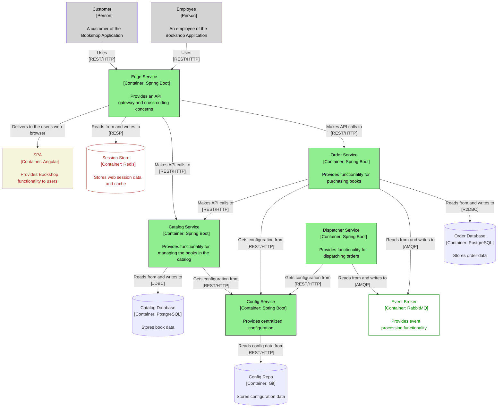

# Deployment for **Bookshop**

**Bookshop** is a cloud native microservices system that sells books online. It features two categories of users:

* *Customers* - can browse books in the catalog, buy some and check out their orders. 
    
* *Employers* - can manage books, update existing ones, and add new items to the catalog
---
## Setup Instructions
* Install [docker](https://docs.docker.com/engine/install/)

* Clone this repository
```bash
git clone https://github.com/bladespring/bookshop-deployment
```
* Navigate to `docker` directory
```bash
cd bookshop-deployment/docker
```
* Run application using [docker-compose](https://docs.docker.com/compose/)
```bash
docker-compose up 
```
---
## Architecture of **Bookshop** System 



